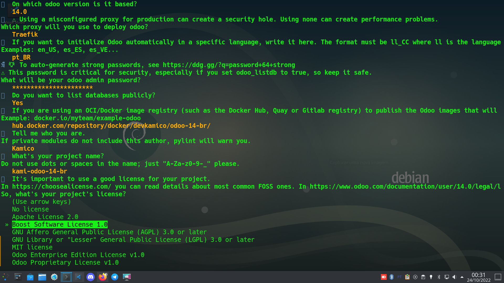
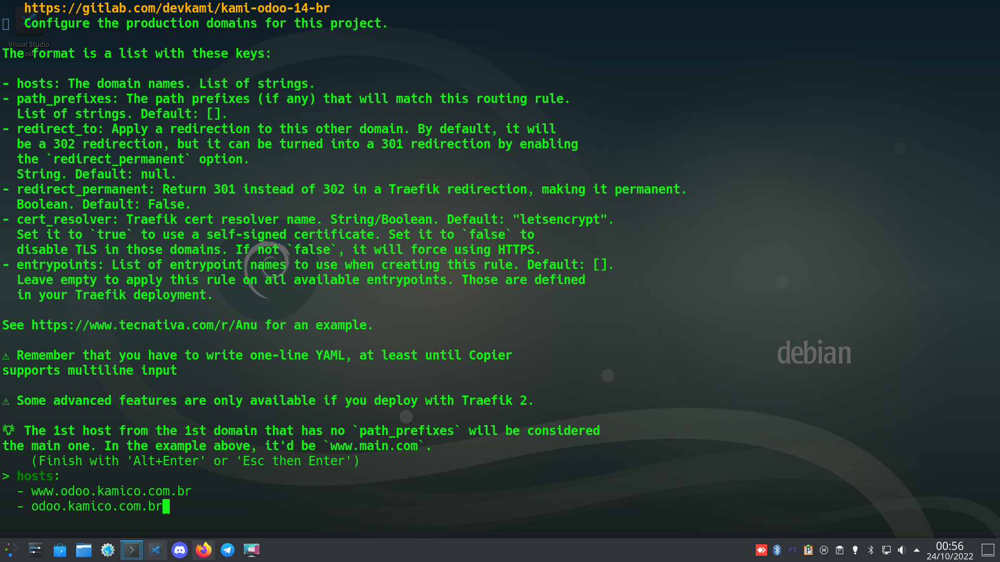
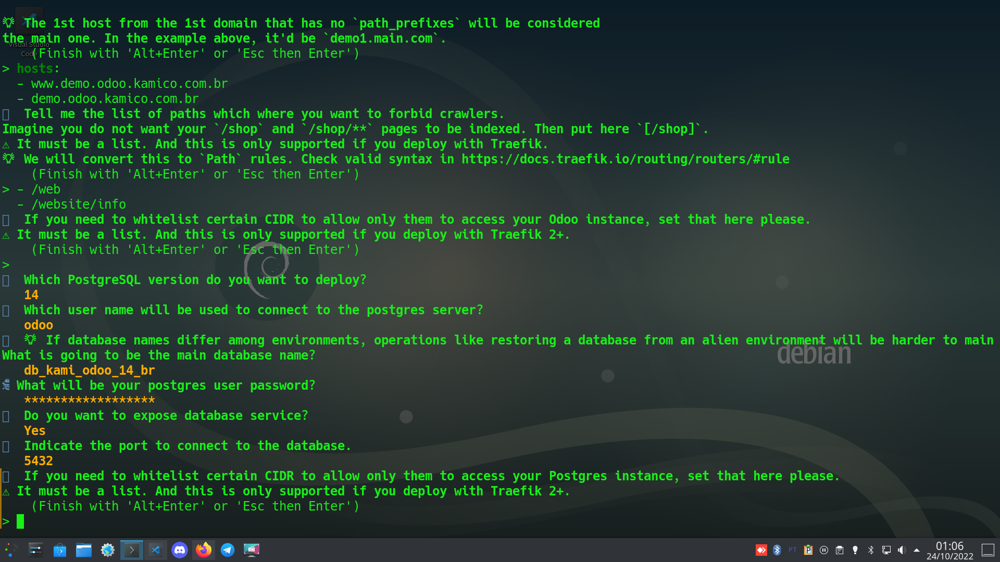
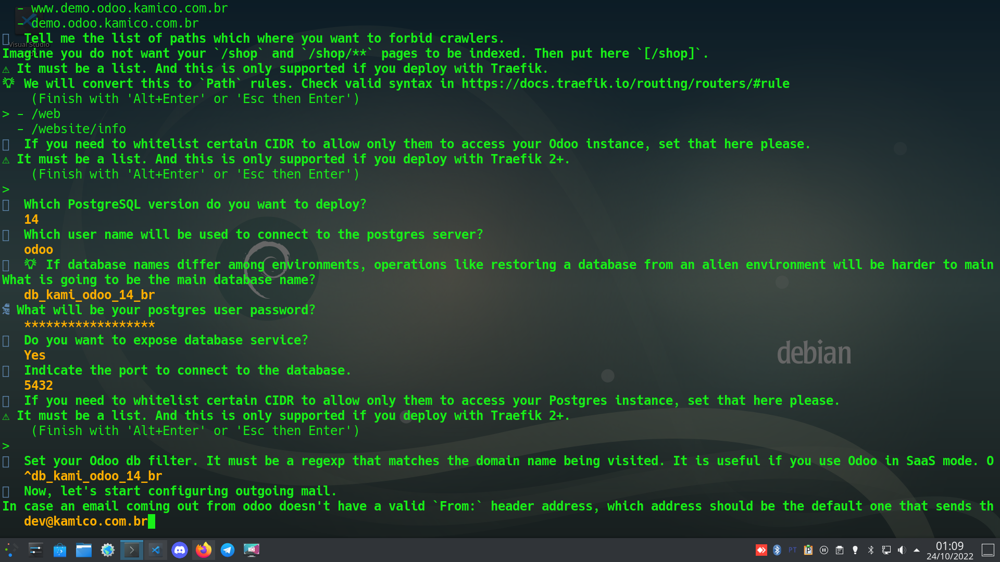
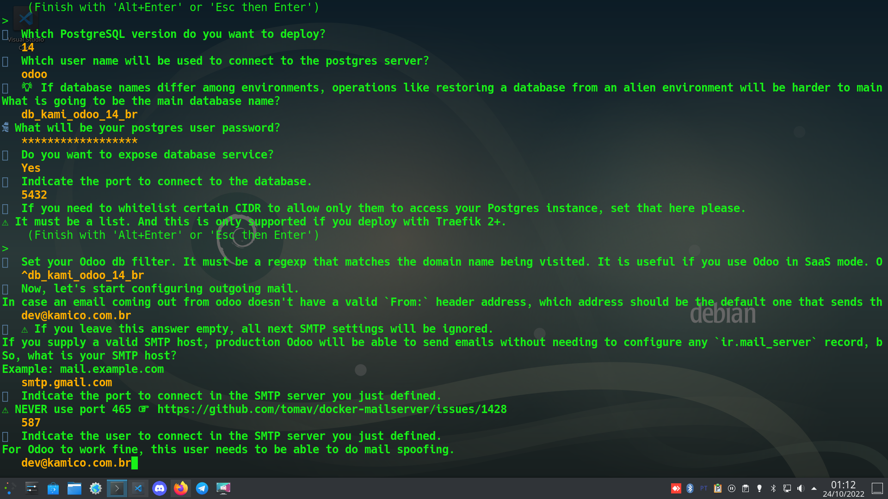

# Passo a Passo configuração de ambiente Odoo Conectativa

## Pré Requisitos

- Linux
- Docker (Com docker compose)
- Copier
- Git
- Postgresql
- VSCode

## Executar Script de Criação do Ambiente

`copier copy gh:Tecnativa/doodba-copier-template ./`

## 1\. Selecione a versão do Odoo desejada


## 2\. Selecione o proxy para deploy

>OBS: Para ambiente de desenvolvimento selecionar **"No proxy"**


## 3\. Selecione o idioma padrão do Odoo


## 4\. Defina a admin do Odoo


## 5\. Defina se o banco de dados será público ou privado


## 6\. Defina o endereço do repositório docker para sua imagem


## 7\. Defina o nome do author dos códigos


## 8\. Defina o nome do seu projeto


## 9\. Selecione o tipo de licensa que irá usar



## 10\. Defina o endereço do projeto no Gitlab


## 11\. Defina os endereços de hospedagem do servidor principal do Odoo

>Caso não tenha definido um servidor proxy no passo 2 apenas pule esta etapa



## 12\.  Defina os endereços de hospedagem do servidor de testes do Odoo

>Caso não tenha definido um servidor proxy no passo 2 apenas pule esta etapa


## 13\. Defina uma lista de de caminhos 'paths' bloqueados para ferramentas de web scraping

>Caso não tenha definido um servidor proxy no passo 2 apenas pule esta etapa


## 14\. Defina uma whitelist para o servidor

>Caso não tenha definido um servidor proxy no passo 2 apenas pule esta etapa


## 15\. Selecione a versão do postgresql para o banco de dados


## 16\. Defina o username do banco de dados


## 17\. Defina o nome do banco de dados


## 18\. Defina a senha do banco de dados


## 19\. Defina defina se o banco será exposto e qual porta será utilizada


## 20\. Defina uma whitelist para acesso ao banco de dados

>Caso não tenha definido um servidor proxy no passo 2 apenas pule esta etapa



## 21\. Defina o filtro para o nome do banco de dados


## 22\. Defina um endereço de email padrão para ser utilizado caso uma mensagem não tenha o campo 'From' preenchido



## 23\. Defina o servidor smtp para envio de mensagens

>OBS: Para ambiente de desenvolvimento apenas deixar em branco


## 24\. Defina a porta utilizada pelo servidor SMTP

>OBS: Para ambiente de desenvolvimento apenas deixar em branco


## 25\. Defina o user name para conectar so servidor smtp

>OBS: Para ambiente de desenvolvimento apenas deixar em branco



## 26\. Digite a senha do user do servidor SMTP

>OBS: Para ambiente de desenvolvimento apenas deixar em branco


## 27\. Defina a versão do docker-mailserver


## 28\. Defina o domínio canonico do servidor de email

>OBS: Para ambiente de desenvolvimento apenas deixar em branco


## 29\. Defina uma lista de outros domínios autorizados a enviar email

>OBS: Para ambiente de desenvolvimento apenas deixar em branco


## 30\. Caso utiliza o serviço de backup da Amazon S3 bucket digite a url para servidor de backup


## 31\. Processo de geração da imagem

>Após responder a última pergunta o script ira gerar a imagem e seus arquivos de configuração, se tudo ocorrer conforme o esperado a seguinte mensagem será exibida confirmando a execução do processo.


## 32\. Dependências [l10n-brazil](https://github.com/OCA/l10n-brazil)

>Preencha os arquivos de dependencias pip.txt e apt.txt com as bibliotecas necessárias para a instalação da localização brasileira da OCA; Os arquivos estão na pasta **'odoo/custom/dependencies/'**


>apt.txt


>pip.txt

## 33\. Repositório de Módulos [l10n-brazil](https://github.com/OCA/l10n-brazil) e [Kami](https://github.com/devkami/kami-odoo-addons-br)

>Esta etapa irá definir repositório [Kami](https://github.com/devkami/kami-odoo-addons-br) e agregar todos módulos do repositório Kami e do repositório [l10n-brazil](https://github.com/OCA/l10n-brazil)

### 32a\. Defina a entrada para o repositório de módulos da Kami no arquivo repos.yaml na pasta **'odoo/custom/src'**

```yaml
./kami-odoo-addons-br:
  defaults:
    depth: $DEPTH_DEFAULT
  remotes:
    kami-odoo-addons-br: https://github.com/devkami/kami-odoo-addons-br.git
  target: kami-odoo-addons-br $ODOO_VERSION
  merges:
    - kami-odoo-addons-br $ODOO_VERSION
```


>arquivo repos.yaml após a modificação

### 32b\. Addons [l10n-brazil](https://github.com/OCA/l10n-brazil) e Kami

>Defina os módulos da  localização brasileira l10n-brazil e módulos Kami no arquivo addons.yaml na pasta **'odoo/custom/src'**
>>OBS: Como o repositório l10n-brazil é parte da OCA, não é necessário configurá-lo no arquivo repos.yaml pois o agregador detecta automaticamente seu endereço

```yaml
l10n-brazil: "*"
kami-odoo-addons-br: "*"
```


>arquivo addons.yaml após a modificação

### 32c\. SSH

> Inclua suas chaves SSH com permissão nos repositórios Kami na pasta **'odoo/custom/ssh'**

### 32d\. Agregando respositórios externos ao projeto

>Faça o download de todos os módulos externos executando o seguinte comando na pasta raiz do projeto:

`invoke git-aggregate`

>Se esta for primeira vez que executa o comando todas as dependências serão instaladas antes do processo e se tudo ocorrer conforme o esperado as pastas com os repositórios e seus módulos serão adicionadas na pasta **'odoo/custom/src'**

## 33\. Iniciando o ambiente de desenvolvimento

>Para iniciar o ambiente de desenvolvimento com dados ficticios para teste e provedor virtual de email basta executar o seguinte comando na pasta raiz do projeto:

`invoke develop`

## 34\. Iniciando o Banco de Dados

>Para iniciar o banco de dados basta executar o seguinte comando na pasta raiz do projeto:

`invoke resetdb`

## 35\. Iniciando o Odoo

>Para finalmente iniciar o Odoo basta executar o seguinte comando na pasta raiz do projeto:

`invoke start`
